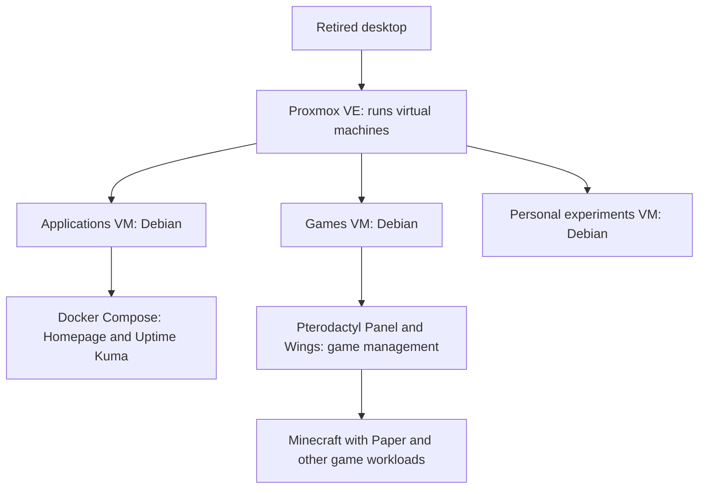

# Architecture overview

One physical computer runs separate environments for applications, games, and
personal experiments. The design gives each kind of work a clear home and a
repeatable setup process.

This diagram shows which environment runs each workload. It is a conceptual
view of the software, not a network or access diagram.

## Why virtual computers?

Each virtual machine, or VM, has its own operating system and assigned virtual
disks. The VMs share the desktop's processor, memory, and physical drives.

| Environment | What it is for | Why it is separate |
| --- | --- | --- |
| Applications | A home dashboard and service monitoring | Application configuration has its own operating system and maintenance scope. |
| Games | Game management plus Minecraft and cooperative games | Game updates and dependencies can be managed together. |
| Personal experiments | Private automation and AI experiments | Experiments have their own operating system and configuration. |

Application **containers** package services and their dependencies while sharing
the operating-system kernel of their VM. Compose describes the everyday
application containers; Pterodactyl manages the game containers. A VM separates
operating systems, while a container packages an application within one.

The tradeoff is more operating systems to update and shared physical capacity
to manage. Separation can reduce interference from software changes, but a host
failure or exhausted shared resources can affect all three environments.

## From a definition to a running service

Each tool handles a different part of the build. Keeping these responsibilities
clear helps explain which layer to change when something needs attention.

| Layer | Responsibility in this lab | Example task |
| --- | --- | --- |
| Git and documentation | Record definitions, changes, and recovery procedures | Review a configuration change and why it was made. |
| OpenTofu | Describe and manage the VMs through Proxmox | Create a disposable VM from a definition. |
| Debian template and cloud-init | Provide a reusable Linux image and initial guest setup | Prepare a new guest's first boot. |
| Ansible | Configure the operating system and service requirements | Apply the shared Linux baseline. |
| Docker Compose or Pterodactyl | Run and manage application or game containers | Start an application or a game workload. |

The [repeatable setup walkthrough](projects.md#repeatable-server-setup) describes
the checks used here. The [tooling guide](tooling-guide.md) provides official
references and a learning sequence for building your own version.

## Monitoring and recovery

Uptime Kuma checks whether selected services respond and receives success
signals from backup jobs. Those checks help identify interruptions; each one
answers only the question it was configured to ask. A responding service may
still need a functional check, such as joining a game.

The backup workflow prepares suitable application and game data, then uses
restic to make encrypted offsite copies. Recovery exercises have covered
selected application data and two Minecraft environments. See the
[recovery walkthrough](projects.md#game-hosting-and-recovery) for the result
and its limits.

The monitor runs on the same physical server as the workloads it watches.
It cannot report from there when that server is off. Offsite data copies help
with a different problem: retaining data outside the machine. These exercises
do not demonstrate a complete physical-host rebuild or automatic failover to
another server.

## Boundaries that matter

The lab is designed for private use. Administrative services stay private, and
anything that might be shared with friends is treated as a separate decision.
The public version of the project never publishes the details that identify the
home network or provide an administration path into it.

## Applying the design to a first lab

Start with one useful service. Identify its saved data, decide what a successful
restore would look like, and try that recovery before adding more workloads.
Separate environments when their maintenance needs justify it; the useful
starting point is a setup you can explain and recover.

[Back to the homelab overview](../README.md) |
[Read the project walkthroughs](projects.md) |
[Read the lessons](what-i-learned.md)
