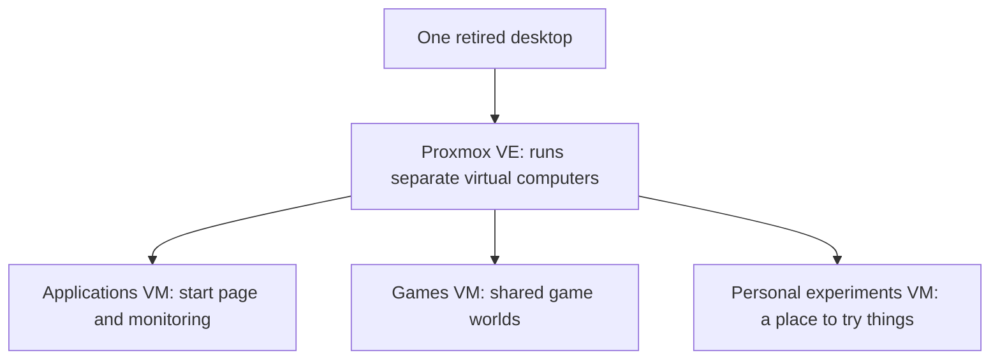

# Architecture overview

One physical computer runs separate environments for applications, games, and
personal experiments. Each environment is a **virtual machine (VM)**: a
computer created in software, with its own operating system. Mine use Debian,
a Linux operating system that provides the foundation for running applications.

If these ideas are new, [Your first homelab](start-here.md) explains the main
terms and walks through a small starting project.

This diagram shows which environment does each job. It is a conceptual
view of the software, not a network or access diagram.

## Why virtual computers?

Each VM has its own operating system, settings, and virtual disks for storing
files. The VMs share the desktop's processor, memory, and physical drives.

| Environment | What it is for | Why it is separate |
| --- | --- | --- |
| Applications | A start page and checks that services respond | Everyday applications have their own settings and updates. |
| Games | Game management plus Minecraft and cooperative games | Game software and the supporting software it needs can be managed together. |
| Personal experiments | Private automation and AI experiments | Trying something new has a separate place for its software and settings. |

Application **containers** package applications with the supporting software
they need. They share the core of the operating system in their VM. Docker
Compose describes how the everyday application containers run; Pterodactyl
manages the game containers. This gives each application a defined setup inside
its virtual computer.

The tradeoff is more operating systems to update. Separation can reduce
interference from software changes, but the physical desktop failing or running
out of memory or processing capacity can affect all three environments.

## From a definition to a running service

Each tool handles a different part of the build. Keeping these responsibilities
clear helps explain which layer to change when something needs attention.

| Layer | Responsibility in this lab | Example task |
| --- | --- | --- |
| Git and documentation | Record definitions, changes, and recovery procedures | Review a configuration change and why it was made. |
| OpenTofu | Describe and manage the VMs through Proxmox | Create a test VM from written settings. |
| Debian template and cloud-init | Provide a reusable starting copy of Linux and its initial setup | Prepare a new VM to start for the first time. |
| Ansible | Configure the operating system and application requirements | Apply common Linux settings. |
| Docker Compose or Pterodactyl | Run and manage application or game containers | Start an application or a game server. |

The [repeatable setup walkthrough](projects.md#repeatable-server-setup) describes
the checks used here. The [tooling guide](tooling-guide.md) provides official
references and a learning sequence for building your own version.

## Monitoring and recovery

Uptime Kuma checks whether selected services respond and receives success
signals from backup jobs. Those checks help identify interruptions; each one
answers only the question it was configured to ask. A responding service may
still need a check of what you actually use it for, such as joining a game.

The backup workflow prepares suitable application and game data, then uses
restic to make encrypted offsite copies: backups stored in another location and
protected with a password. Recovery exercises have covered selected application
data and two Minecraft environments. See the
[recovery walkthrough](projects.md#game-hosting-and-recovery) for the result
and its limits.

The monitor runs on the same physical server as the applications it watches.
It cannot report from there when that server is off. Offsite data copies help
with a different problem: retaining data outside the machine. These tests
recovered selected application and game data; rebuilding the entire physical
server was not covered by these exercises.

## Boundaries that matter

The lab is designed for private use. Administrative services stay private, and
anything that might be shared with friends is treated as a separate decision.
The public version of the project never publishes the details that identify the
home network or provide an administration path into it.

## Applying the design to a first lab

Start with one useful service. Identify its saved data, decide what a successful
restore would look like, and try that recovery before adding more workloads.
Separate environments when their maintenance needs justify it; the useful
starting point is a setup you can explain and recover.

[Back to the homelab overview](../README.md) |
[Plan a first lab](start-here.md) |
[Read the project walkthroughs](projects.md) |
[Read the lessons](what-i-learned.md)
